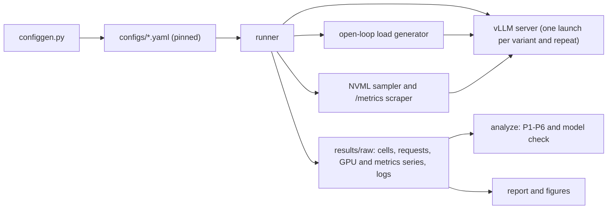

# tokenomics-bench

[](https://github.com/RyanJHamby/tokenomics-bench/actions/workflows/ci.yml)

**Where does an LLM server's cheapest and most energy-efficient configuration sit once it is held to a latency SLO?**
A pre-registered, budget-capped benchmark of vLLM on one rented GPU, measuring goodput per dollar and goodput per joule across clock locks, power caps, quantization, CUDA-graph modes and workload shape.

> **Status: harness built and pre-registered; hardware runs not yet performed.**
> This README therefore contains **no measured results**. Every number that will appear here must come from a
> captured run in [`results/`](results/) with the hardware named. Until then, what this repository offers is the
> method, the harness, and a plan that is committed in advance so the results cannot be steered after the fact.

## The question

Serving cost is usually discussed as throughput. Operators actually buy **goodput**: tokens per second from requests
that met their latency target. Energy is usually discussed as a power cap. On a decode-heavy workload a cap often never
binds, because the GPU draws far below its limit, while locking the SM clock does change energy per token. Whether that
holds on a given GPU, model and workload mix, and what it costs in goodput and dollars, is an empirical question with a
subtle answer: the energy-optimal clock and the cost-optimal clock need not coincide, because rental is billed per hour
and electricity is a small fraction of it.

This project measures that frontier directly, on one GPU, under a p99 SLO, with the statistics decided before the data.

## Prior work, and what this adds

The headline mechanism is not new. *The Illusion of Power Capping in LLM Decode* (Ma et al., arXiv 2605.11999,
May 2026) reports, on a single H200 running vLLM with ≈4B dense models at batch sizes 1-32, that decode draws far below
the board limit so a power cap never triggers, and that locking the SM clock recovers up to 32% of decode energy. Its
limitations name MoE models and other GPU generations as open, and it reports no SLO or goodput metric. Adjacent work
measures inference energy under realistic serving load (the ML.ENERGY Benchmark, NeurIPS D&B 2025; Watt Counts,
arXiv 2604.09048) or continuously benchmarks inference performance across hardware (InferenceX, formerly InferenceMAX).
As far as I could find, none reports goodput-per-joule and goodput-per-dollar under an SLO with lock-vs-cap arms on one
GPU under vLLM; that search was not exhaustive.

This repository therefore **replicates and extends** rather than claiming priority:

| Extends prior work by | How |
|---|---|
| A different memory technology and generation | GDDR6 Ada (L40S) rather than HBM Hopper |
| A realistic prefill/decode mix and a shape sweep | 512/128 headline plus decode-heavy and prefill-heavy loads |
| An SLO and a dollar layer | Goodput under p99 TTFT/TPOT; $/Mtok from the live rental rate |
| A mixture-of-experts arm | Qwen3-30B-A3B-FP8, exploratory |
| Pre-registered inference | Numeric hypotheses, equivalence tests, inconclusive reported as inconclusive |

The method is written to be reused regardless of what the numbers turn out to be. A null result ("neither knob matters
on this card") is a legitimate outcome and is reported as one.

## Design principles

| Principle | What it means here | Where |
|---|---|---|
| **Pre-registration** | Hypotheses, margins, SLO, window definitions and the statistical procedure are fixed and tagged before any GPU run. Later changes are dated amendments, not edits. | [`PREREG-v2.md`](docs/PREREG-v2.md), [`amendments`](docs/PREREG-v2-amendments.md), tags `prereg-v1`/`v2`/`v2.1`/`v2.2` |
| **Predictions first** | A roofline and fluid-batching model commits numeric intervals before measurement; the write-up reports predicted vs measured, misses included. The model is not refit. | [`PREDICTIONS.md`](docs/PREDICTIONS.md), [`model.py`](src/tokbench/model.py) |
| **Goodput, not throughput** | Failed, truncated and still-running requests count as SLO misses and are never dropped. | [`loadgen/stats.py`](src/tokbench/loadgen/stats.py) |
| **One measurement window** | Latency and attainment by arrival time; throughput, goodput and energy by completion time, over the same steady-state window, so J/token and tokens/s describe identical work. | [`runner.py`](src/tokbench/runner.py) |
| **Open-loop load** | Poisson arrivals timed from the *scheduled* arrival (no coordinated omission); capacity is found by doubling then bisection to a fixed resolution, not read off a coarse grid. | [`loadgen/client.py`](src/tokbench/loadgen/client.py), [`capacity.py`](src/tokbench/capacity.py) |
| **No cache leakage** | Prompts are exact token ids, salted per load and repeat, so each load starts cold and the prefix cache cannot flatter later loads. | [`workloads.py`](src/tokbench/workloads.py) |
| **Honest statistics** | The unit of replication is a *launch* (a server restart), not a request. Paired per-launch log ratios with t intervals; margin-based verdicts (`superior`, `equivalent`, `inconclusive`); Holm over the superiority tests; repeats sized from a pilot's variance. | [`analysis/paired.py`](src/tokbench/analysis/paired.py), [`pilot.py`](src/tokbench/pilot.py) |
| **Energy from the counter** | NVML cumulative energy counter over the measurement window, with the sampled-power integral as a cross-check. Board power only; host and cooling excluded and said so. | [`telemetry/gpu.py`](src/tokbench/telemetry/gpu.py) |
| **Arms from measurement, not guesses** | Power-cap and clock-lock levels are generated from the pilot's measured saturated draw and the card's real limits; levels the driver would refuse are dropped, not attempted. | [`arms.py`](src/tokbench/arms.py) |
| **Validity rules** | A cell is excluded and listed (never silently dropped) if the server saw a different prompt length than configured, the sampler died, the load generator's event loop lagged, or thermal/hardware throttling occurred. | [`analyze.py`](src/tokbench/analyze.py) |
| **Pinned everything** | dtype, generation config, scheduler limits, attention backend, seed, and model/tokenizer revision SHAs are pinned in every config. Configs are generated from one source and a test fails if committed YAML drifts. | [`configgen.py`](src/tokbench/configgen.py) |
| **Recoverable data** | Every request, the full GPU and vLLM-metrics time series, server logs, wall-clock anchors and an environment bundle are saved, so results can be re-derived or re-sliced after the machine is gone. | [`capture.py`](src/tokbench/capture.py) |

## Experiment plan

Planned GPU time is an estimate from the harness's own cost model (`make estimate`), before retries: roughly 14-15
hours for the confirmatory core and about 18 including the exploratory blocks. A hard **$60** cap across all attempts is
enforced by a spend ledger the runner consults; the exploratory blocks are the first thing it cuts.

| Block | Question | Status |
|---|---|---|
| **B1 pilot** | SLO capacity of the FP16 baseline, batch-1 decode speed, saturated power draw, and launch-to-launch variance (which sizes everything after it) | confirmatory data |
| **B2 power cap vs clock lock** | Does a lock cut J/token where a cap does not, and at what goodput cost? Does the energy-optimal clock differ from the cost-optimal one? | **core finding** |
| **B3 quantization** | FP8 capacity and quality (full GSM8K, paired); FP8-KV and AWQ exploratory | P4/P5 confirmatory |
| **B4 CUDA-graph modes** | Graph benefit by batch size, isolated from `torch.compile` | P6 confirmatory |
| B2 shape loads | Does lock-vs-cap flip between decode-heavy and prefill-heavy workloads? | exploratory |
| B5 overload and recovery | Goodput collapse past capacity and time to recover | exploratory |
| B6 MoE arm | Active-parameter effects on the energy curve (Qwen3-30B-A3B-FP8) | exploratory |
| B7 SGLang cross-check | One engine cross-check, flags unverified | exploratory, last |

Primary SLO: p99 TTFT ≤ 1.0 s and p99 TPOT ≤ 50 ms. Feasibility is also recomputed at (0.5 s, 30 ms) and (2 s, 100 ms)
from the stored p99s as a sensitivity check.

### Pre-registered hypotheses

| # | Claim | Comparison | Margin |
|---|---|---|---|
| P1 | A clock lock at ~70% of max SM clock cuts energy per token | J/token vs baseline, at saturation and at 0.7× capacity | superior, 10% |
| P2 | ...without a goodput cost | goodput, same loads | equivalent, 5% |
| P3 | A power cap at 80% of saturated p95 draw does not bind in decode | J/token and goodput vs baseline | equivalent, 5% |
| P4 | FP8 weights raise SLO capacity | capacity vs FP16, paired by launch | superior, 20% |
| P5 | ...with non-inferior quality | GSM8K, paired McNemar and CI | non-inferior, 2 pp |
| P6 | The CUDA-graph benefit is larger at batch 1 than at batch 64 | TPOT ratio, paired difference | CI excludes 0 |

P2 and P3 carry **recorded failure risk**: by the repo's own roofline model, prefill is a large share of saturated GPU time
at 512/128, so a 70% lock may cost goodput and a cap may bind during prefill bursts. Both stay as stated and will be
reported as measured.

## How it works



The runner starts a server per (variant, repeat), runs a short canary request, a saturating soak, an idle-power baseline,
and then the loads in a seeded random order. A detached watchdog restores GPU clocks and the default power limit and kills
the server if the runner is killed. A spend ledger refuses work that would exceed the budget.

## Repository map

```
src/tokbench/
  loadgen/        open/closed/phased load generation, windowed stats, client-saturation monitor
  telemetry/      NVML sampler (+fake backend), vLLM /metrics scraper, hardware probe
  analysis/       paired-launch statistics, cost and frontier accounting
  runner.py       experiment orchestration, resume, fail-fast, signal handling
  capture.py      persistence: per-request records, series, environment bundle, crash bundle
  configgen.py    single source of truth for every config
  model.py        roofline / fluid-batch predictions
  analyze.py      executes the pre-registered analysis mechanically
  watchdog.py     out-of-process GPU/server cleanup      budget.py   spend ledger
configs/          generated experiment configs            docs/       pre-registration, runbook, predictions, journal
scripts/          pod setup, preflight, run, sync         tests/      200+ tests; none require a GPU
```

## Quick start (no GPU needed)

```bash
python -m venv .venv && . .venv/bin/activate
make install          # pip install -e ".[dev]"
make test             # mock-server and fake-GPU tests
make demo             # synthetic end-to-end run; output is watermarked and is NOT a result
make estimate PRICE=1.0   # planned GPU-hours and dollars per block
```

To run on real hardware, follow [`docs/RUNBOOK.md`](docs/RUNBOOK.md): pre-rental checklist, pod setup, preflight (version
pins, writable power controls, flag and revision checks), the cross-check against `vllm bench serve`, and the ordered
block sequence. Never hand-edit `configs/`; change `configgen.py` and run `make configs`.

## Evidence and reproducibility

- **Signed commits and tags.** History is small signed steps; the pre-registration tags are signed.
- **Engineering journal.** [`docs/journal.md`](docs/journal.md) records decisions, dead ends and pre-run amendments as they
  happened, including bugs found by review and the corrections they forced.
- **Claims trace to raw data.** Results are quoted only from `pow run` captures in [`results/`](results/); raw per-request
  and per-sample data are retained alongside summaries.
- **Pre-run adversarial review.** Nine separate review passes (run by AI agents, see below) attacked the method, the code,
  the hardware assumptions, the real-server protocol and the telemetry before any GPU spend; their findings and what
  changed are in the journal and amendments.

## Limitations and threats to validity

Stated up front, and repeated in the pre-registration:

- One GPU model and size, one model family (plus one MoE arm), one workload shape (plus two exploratory shapes). Results do
  not transfer to HBM parts, other architectures, multi-GPU or tensor-parallel serving, long context, or disaggregation.
- Prompts are random token ids: valid for dense-model compute and cache mechanics, **not** for anything whose speed depends
  on text predictability (n-gram speculation) or for real traffic length distributions.
- Energy is GPU board power. Host CPU, cooling and PUE are excluded; electricity is a small fraction of rental cost and is
  reported but not added to $/Mtok.
- Rental price is a snapshot; a pod's silicon and cooling vary, so a result describes one machine on one day.
- AWQ is a third-party checkpoint (a model change as well as a precision change). FP8-KV changes the attention backend as
  well as the KV dtype on this GPU (a kernel confound). Both are labelled exploratory.
- The prediction model's L40S and H100-SXM hardware figures were checked against NVIDIA's product pages on 2026-10-06
  (NVIDIA lists the sparsity figures; dense is half). The H100-PCIe entry and the model's efficiency ranges are assumptions.
  The SGLang flags have not been verified against a source tree.
- The harness has been validated against mock servers, a fake GPU backend, and a real local streaming server for client
  behavior. **vLLM-specific and NVML-specific behavior is unverified on hardware**; the first run is partly a smoke test.

## Roadmap

Done: pre-registration, harness, predictions, persistence, safety (watchdog, canary, ledger), analysis, configs.
Next: first hardware run (pilot, then core blocks), then figures and the written analysis. Not yet built: a versioned result-schema document, an accuracy-parity gate wired into every quantized arm, and a per-run
provenance index.

## How this was built

The research question, the thesis, the $60 budget cap and the scoping decisions are the author's. The harness, tests,
pre-registration drafts and the adversarial design reviews were produced with an AI coding assistant (Claude Code)
working in this repository under the author's direction; commits carry a `Co-Authored-By` trailer. **The author directed
the design and decisions and has not yet read every file line by line; that review is in progress and is being done
before the first hardware run.** The AI-generated reviews are claims to check, not authority: several findings were
re-verified by hand (noted in the journal) and others were not. Statements about results are made only from captured runs
in [`results/`](results/).

## License

MIT. See [`LICENSE`](LICENSE).

## Author

Ryan Hamby ([@RyanJHamby](https://github.com/RyanJHamby)). Thesis: *make AI compute fast, efficient, and reliable, from the
serving layer down to the hardware and the power behind it.*
